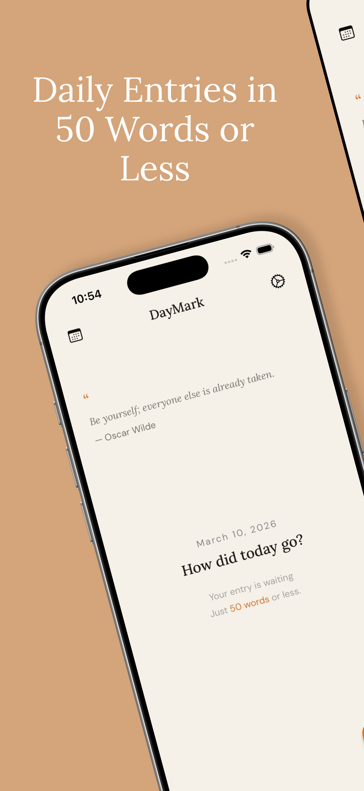
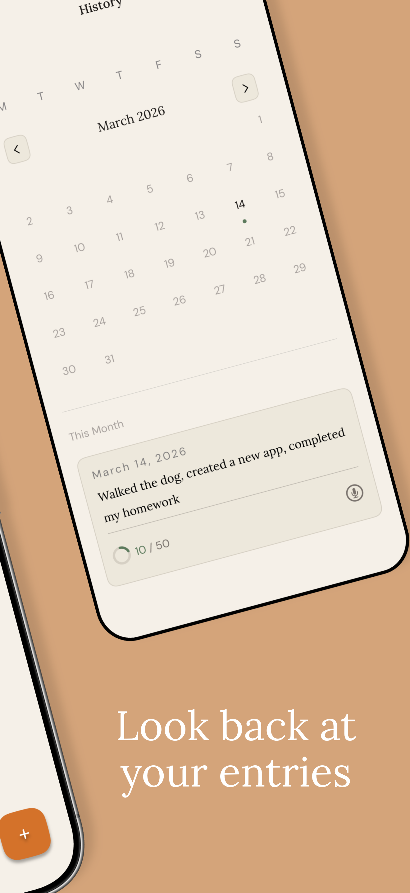
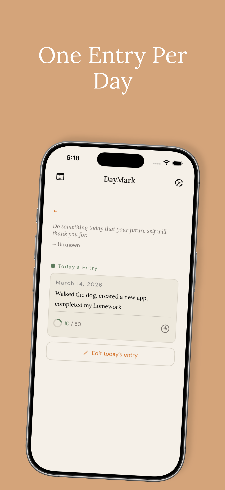
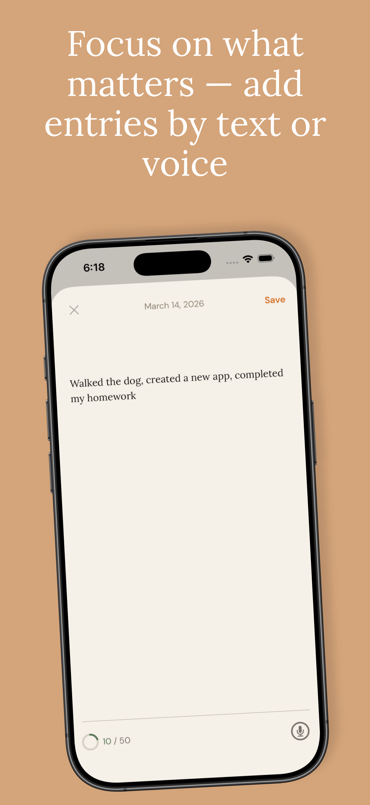
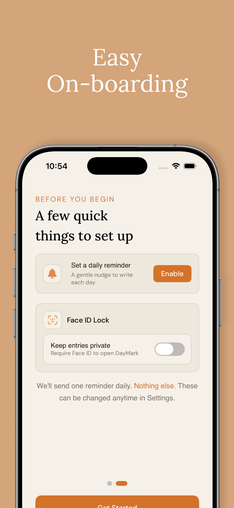
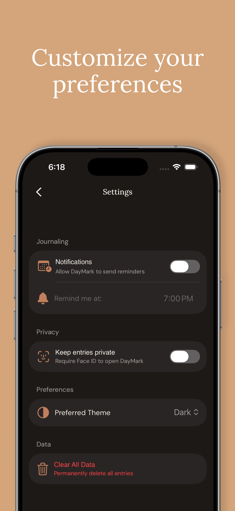

+++
title = "Building out DayMark - 0 to 1"
date = 2026-03-16
draft = false
author = "Kein Li"
+++

### Building Out DayMark App

https://apps.apple.com/us/app/daymark-daily-journal/id6760376611

  
  
  
  
  
  

#### Idea + Design

I found the easiest way to keep building any app or side project without
abandoning it midway is to build something useful that you'll actually use.

For me, I started writing down 1-3 sentences of what I did each day to
ensure each day was somewhat productive. I believe small wins over a long period
time add up and there will be an inflection point where you start seeing
exponential growth. I used the notes app to do it but wanted a better UI
with it.

That's how I got started with DayMark. I wanted an app that was not insanely
complicated to build but had a bunch of little cool features and one that
I would actually use daily.

For the design, I worked with Claude and told it what color palette I liked and
what I wanted certain screens to look like. I'm not a creative person but I am
very picky when it comes to how I want things to look (more on this later)

Claude gave me a bunch of mockups and I picked the one I liked the most and built
my app from there

#### Development

I was extremely picky with the UI and how I wanted things to look. Even though
I used two fonts (Lora and DM-Sans), I spent a lot of time deciding which
text looked better with which font and weight. To make this consistent, I created
a font extension + view modifiers so common text styles were consistent throughout
the app

I actually spent a lot of time on FaceID + Notifications + User Defaults. There
were a lot of edge cases to deal with. For example, in Notifications, there are
both User-enabled and Device-enabled notifications. Users can still opt out of
notifications even if the device is enabled.

Similarly for FaceID, I used a toggle for the UI and a value which
read from user defaults (since users can opt into FaceID, but also there is
an OS level on whether FaceID is even enabled)

One big issue with this is if FaceID failed or was not allowed, the toggle wouldn't roll back. I dealt with this using a computed binding which read from my view model of the FaceID status via `get` and update during `set`. If the biometrics failed, I roll back the value. (The value that is being read from the toggle is the computed binding, but this value is derived from a value i save/get from User Defaults)

Previous I ran into infinite loop issues with toggle when i tracked it via the
`.onChange` modifier

Another thing I dealt with was using @AppStorage for User Defaults. I wanted to
mainly keep the logic inside my View Model, so instead of using @AppStorage (which i think
is mainly designed for views), I used the standard User Defaults `get/set`.
For properties i was monitoring (i.e user notification time and preference),
I had the value saved but called `didSet` on it to update the UserDefaults

The last tough feature was adding voice and microphone support. I basically took
the code from Apple's sample code for speech recognition and adapted it to my
app. Speech can get surprisingly tricky to handle: once again there is OS level
permission AND user level permission(with microphone access)

#### Deploying to App Store

This process was actually kind of time consuming to do since it was my very
first time doing it. Its much more involved than deplyoing a website where its
as easy as linking your repository to something like Railway / AWS Amplify. It also
costs $99 to enroll in the Apple Developer Program.

I used AppScreens to take screenshots for my app. There were many templates and
variations so I spent some time picking the ones I liked. There is a nice
feature where you setup the API key credentials and it links directly to your
app store page to automatically populate the screenshots for you. Ultimately
I had to pay $25 for the plan to use the right templates and have this workflow
setup.
